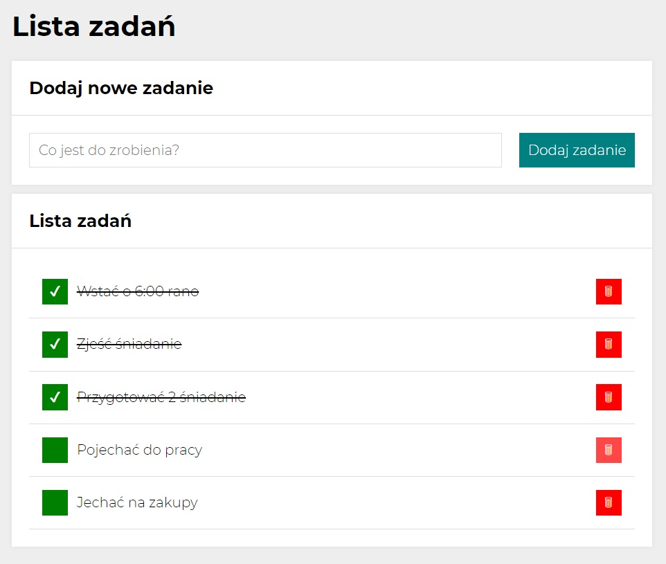

# To-do list

## DEMO

[**To-do-list**](https://piotrkubiak.github.io/todolist/)

### It is an application for creating a to-do list

1. Enter the various tasks to be performed in the box
2. When you complete the task, you can click the green icon and mark it as completed
3. You can also delete a given task by clicking on the red icon

You can approve tasks by clicking Enter.
The application works correctly on high resolutions and on small ones.

**Thank you for using the app!**